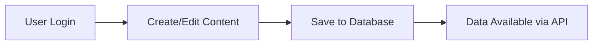
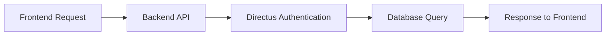

# CMS for Pool & Token Management System

A modern, containerized Content Management System (CMS) for managing pools, custom tokens, and wallets with a robust backend API.

## 🚀 Features

- **🔐 Secure CMS Interface** - Directus-powered content management
- **📊 Data Management** - Manage pools, tokens, and wallets through intuitive forms
- **🌐 RESTful API** - TypeScript backend with automatic authentication
- **🐳 Docker Ready** - Complete containerized development environment
- **🔄 Real-time Updates** - Changes in CMS instantly available via API
- **🛡️ Security First** - Helmet middleware and CORS protection

## ��️ Architecture
```

┌─────────────────┐    ┌─────────────────┐    ┌─────────────────┐
│   Directus CMS  │    │  Backend API    │    │   Frontend      │
│   (Port 8055)   │◄──►│  (Port 3001)    │◄──►│  (Port 3000)    │
└─────────────────┘    └─────────────────┘    └─────────────────┘
         │                       │                       │
         ▼                       ▼                       ▼
┌─────────────────┐    ┌─────────────────┐    ┌─────────────────┐
│   PostgreSQL    │    │   Redis Cache   │    │   React App     │
│   (Port 5432)   │    │   (Port 6379)   │    │   (Demo UI)     │
└─────────────────┘    └─────────────────┘    └─────────────────┘
```

## 🔄 Workflow

### 1. **Content Management**
   - **User** log into Directus CMS
   - **Add/Edit** pools, custom tokens, and wallets
   - **Data saved** to PostgreSQL database

### 2. **API Layer**
   - **Backend** automatically authenticates with Directus
   - **Fetches data** via Directus API
   - **Applies business logic** if needed
   - **Serves data** to frontend applications

### 3. **Data Consumption**
   - **Frontend apps** call backend API
   - **Real-time data** from CMS
   - **Instant updates** when content changes

## 🛠️ Tech Stack

### **Backend**
- **Runtime**: Node.js with TypeScript
- **Framework**: Express.js
- **Security**: Helmet, CORS
- **Database**: PostgreSQL (via Directus)
- **Cache**: Redis
- **Authentication**: Directus JWT tokens

### **CMS**
- **Platform**: Directus (Headless CMS)
- **Interface**: Modern web-based admin panel
- **Database**: PostgreSQL
- **Authentication**: Built-in user management

### **Infrastructure**
- **Containerization**: Docker & Docker Compose
- **Database**: PostgreSQL 15
- **Cache**: Redis 7
- **Networking**: Custom bridge network

## 📋 Prerequisites

- **Docker** (version 20.10+)
- **Docker Compose** (version 2.0+)
- **Node.js** (version 18+)
- **npm** or **yarn**

##  Quick Start

### 1. **Clone the Repository**
```bash
git clone https://github.com/NishantCoder108/cms-for-pool
cd cms-for-pool
```

### 2. **Start the CMS Services**
```bash
cd cms
docker-compose up -d
```

### 3. **Set Up Backend**
```bash
cd backend
npm install
npm run dev
```

### 4. **Access Your Services**
- **CMS Interface**: http://localhost:8055
- **Backend API**: http://localhost:3001
- **Database**: localhost:5432

##  Configuration

### **Environment Variables**

Create `.env` file in the backend directory:

```env
DIRECTUS_URL=http://localhost:8055
DIRECTUS_ADMIN_EMAIL=admin@darklake.fi
DIRECTUS_ADMIN_PASSWORD=admin
PORT=3001
NODE_ENV=development
```

### **CMS Setup**

1. **Login to Directus**: `admin@darklake.fi` / `admin`
2. **Create Collections**:
   - `pools` - For managing trading pools
   - `custom_tokens` - For custom token data
   - `wallets` - For wallet management

##  API Endpoints

### **Health Check**
```http
GET /health
```

### **Pools Management**
```http
GET /api/pools          # Get all pools
GET /api/pools/:id      # Get specific pool
```

### **Custom Tokens**
```http
GET /api/tokens         # Get all tokens
GET /api/tokens/:id     # Get specific token
```

### **Wallets**
```http
GET /api/wallets        # Get all wallets
GET /api/wallets/:id    # Get specific wallet
```

## 🧪 Testing

### **Test Commands**
```bash
# Test backend health
curl http://localhost:3001/health
```

### pools API
curl http://localhost:3001/api/pools
```json
[
    {
        "id": "4415777a-d727-42cc-8f94-a105e0a33bf1",
        "Name": "JPool",
        "Description": "High-yield staking with liquid JSOL, optional MEV",
        "Chain": "SOL",
        "Address": null,
        "Pool_Type": "Liquid + Direct Staking",
        "TVL": "8000004",
        "APY": "7700000"
    },
    {
        "id": "59ce182b-c031-4a59-ab14-99c14882ce18",
        "Name": "DXDY-DXL Pool",
        "Description": " Pool High liquidity pool for swapping DXDY and DXL on Solana.",
        "Chain": "SOL",
        "Address": "mSoLUSdC1234567890ExampleAddress",
        "Pool_Type": "Liquidity Pool",
        "TVL": "1500000",
        "APY": "12200000"
    },
]

```


###  tokens API
curl http://localhost:3001/api/tokens

```json

[
    {
        "id": "592e85e4-a722-40e8-8475-c0658e3d84be",
        "Name": "Darklake Staking Token",
        "Symbol": "DLST",
        "Address": "0xabcdef1234567890abcdef1234567890abcdef12",
        "Chain": "ETH",
        "Decimals": 9,
        "Logo_URL": "https://beta.darklake.fi/image/dlst.png",
        "Website": "https://beta.darklake.fi"
    }
]

```


### wallets API
curl http://localhost:3001/api/wallets

```json
  {
        "id": "951b7755-277e-47c8-abc1-98b584bd47bd",
        "Name": "Marketing & Partnerships",
        "Address": "0xabcdef1234567890abcdef1234567890abcdef34",
        "Chain": "ETH",
        "Description": "Wallet for marketing expenses and partnership payments",
        "Wallet_Type": "Operations",
        "Contract_Balance": 75000,
        "tags": [
            "low-risk",
            "ethereum"
        ]
    }

```


## 🔐 Authentication

The system uses **automatic authentication**:

- **Backend** automatically logs into Directus
- **JWT tokens** are managed transparently
- **Token refresh** happens automatically on expiry
- **No manual token management** required

## 🐳 Docker Services

### **Service Overview**
```yaml
services:
  postgres:     # PostgreSQL database
  directus:     # CMS platform
  redis:        # Caching layer
  backend:      # API server
  frontend:     # Demo interface
```

### **Port Mapping**
- **8055**: Directus CMS
- **3001**: Backend API
- **5432**: PostgreSQL
- **6379**: Redis

## 📈 Development Workflow

### **1. Content Creation**


### **2. API Consumption**


##  Deployment

### **Development**
```bash
# For CMS run
docker-compose up -d

# For CMS stop
docker-compose down 

npm run dev
```


## 🤝 Contributing

### **Development Setup**
1. Fork the repository
2. Create feature branch
3. Make changes with tests
4. Submit pull request

### **Code Standards**
- Follow TypeScript best practices
- Use consistent formatting
- Add proper error handling
- Include API documentation
---
Built with ❤️ by the Nishant

